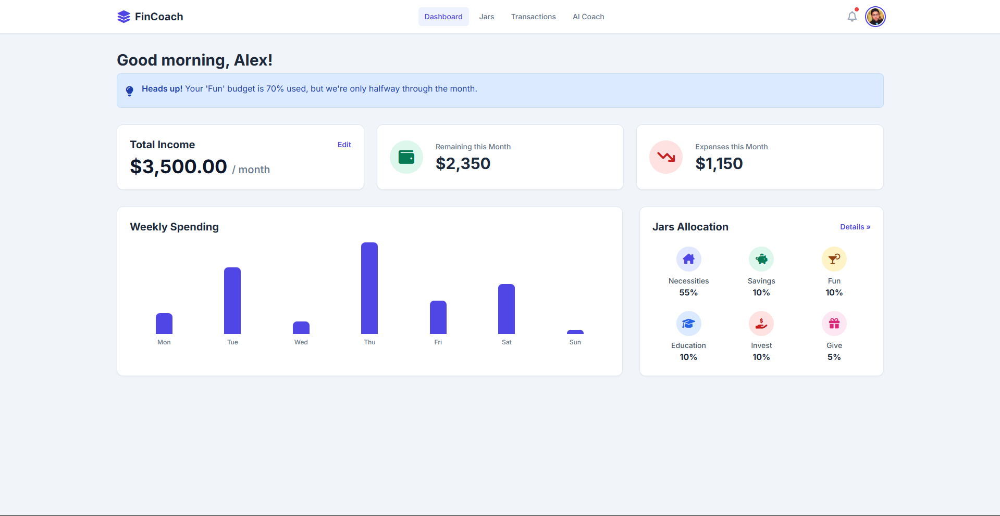
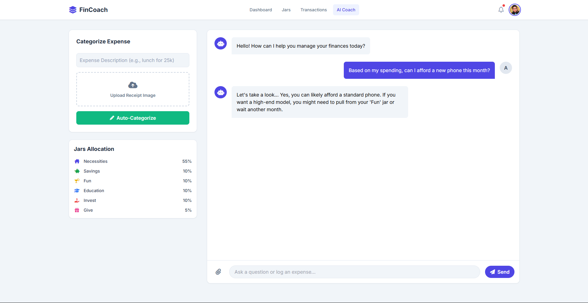
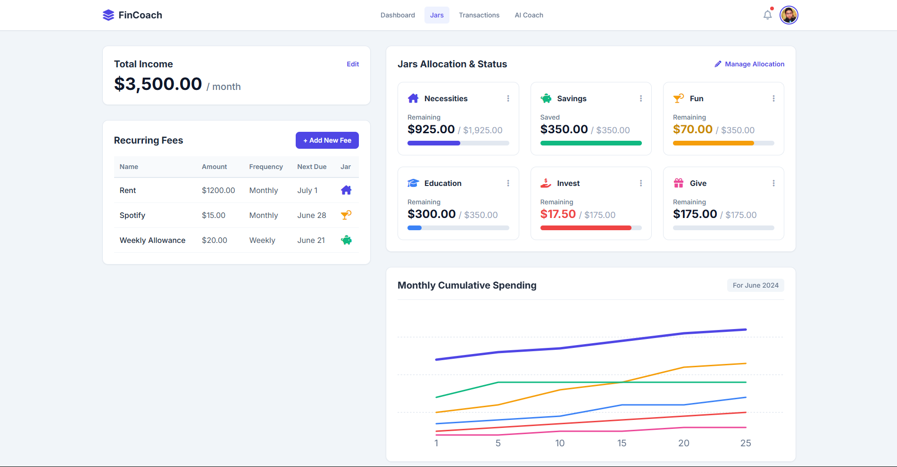
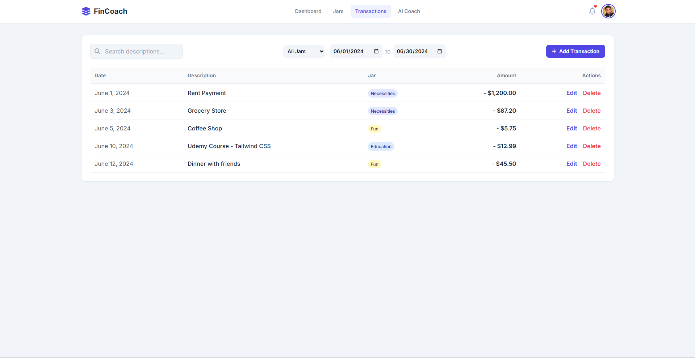

# AI Financial Coach

**Your Personal AI-Powered Guide to Financial Freedom.**

This project is a web application developed for a hackathon, designed to help users manage their personal finances using a simple "6 Jars" budgeting system, supercharged with AI assistance. It transforms the tedious task of budgeting into an interactive, conversational, and proactive experience.

---

## 🚀 The Problem

Traditional budgeting apps are often reactive, requiring manual data entry and complex setups. Users get lost in spreadsheets and forms, and by the time they realize they've overspent, it's already too late. This app addresses these pain points by making financial management:
*   **Conversational:** Log expenses and get advice by talking to an AI, just like a real coach.
*   **Proactive:** Receive intelligent alerts *before* you overspend, not after.
*   **Simple:** The "6 Jars" method provides a clear, proven framework for allocating your income.

## ✨ Key Features

Our application is built around a set of core features designed to provide a seamless user experience, blending manual control with powerful AI assistance.

*   **🧠 Smart Income Allocation**
	*   **Manual:** Users can manually set their income and allocate a percentage to each of the 6 "jars."
	*   **AI-Assisted:** Tell the AI your financial goals in plain language (e.g., "I want to save for a trip"), and it will propose a personalized budget plan.

*   **🗣️ Conversational Transaction Logging**
	*   **Manual:** Log expenses through a simple, clean form.
	*   **AI-Assisted:** Log expenses by typing conversational text ("I spent $10 on coffee and $50 on gas") or by uploading a receipt image. The AI parses the info, suggests categories, and asks for confirmation.

*   **🔄 Intelligent Recurring Fee Detection**
	*   **Manual:** A dedicated interface to create, view, edit, and delete recurring expenses like subscriptions or rent.
	*   **AI-Assisted:** Mention a recurring fee in the chat ("don't forget my $15 Spotify subscription"), and the AI will recognize it and offer to set it up automatically.

*   **📈 Proactive Tracking & AI Alerts**
	*   A background Predictive Burn-Rate Model analyzes spending habits.
	*   If the system forecasts that a user is on track to overspend in a category, the AI Coach proactively sends a helpful, forward-looking notification with advice.

*   **💬 On-Demand AI Coaching**
	*   A central chat interface where users can ask a wide range of financial questions, from personalized advice ("Based on my spending, can I afford a new phone?") to general knowledge ("What is the 50/30/20 budget rule?").

## 🛠️ Technology Stack

This project was built with a focus on rapid development and a clean user interface, making it ideal for a hackathon setting.

*   **Front-End:** Pure HTML5, CSS3, and vanilla JavaScript.
*   **Styling:** **Tailwind CSS** (via CDN) for a utility-first, responsive design system.
*   **Icons:** **Font Awesome** for a clean and comprehensive icon set.
*   **AI Simulation:** The AI logic and responses are simulated on the front-end for this demo to showcase the full user experience flow.

## 📂 Project Structure

The application is organized into four main pages, each representing a core part of the user journey.

*   `index.html`: The main **Dashboard**, providing a high-level overview of the user's financial health.
*   `ai-coach.html`: The **AI Coach** interface, featuring a two-column layout for chat and budget controls.
*   `jars-management.html`: The **Jars Management** screen, where users can configure their budget, manage recurring fees, and view spending statistics.
*   `transactions.html`: A detailed **Transaction History** log with powerful filtering and search capabilities.

## 🏁 Getting Started

This is a static front-end project and does not require any build steps or complex installation.

1.  **Clone the repository:**
	```bash
	git clone https://github.com/HCMUS-HQHuy/VPBANK-HACKATHON.git
	```
2.  **Navigate to the project directory:**
	```bash
	cd VPBANK-HACKATHON
	```
3.  **Open the HTML files in your browser:**
	Simply double-click any of the `.html` files (e.g., `index.html`) to open them directly in your web browser (like Chrome, Firefox, or Edge).

That's it! You can now explore the full functionality of the application.

## 📸 Screenshots

### Dashboard
Shows the main overview with financial stats and weekly spending.  


### AI Coach
Highlights the three-column layout with the chat interface.  


### Jars Management
Displays the jar cards and the cumulative spending chart.  


### Transaction Log
Shows the filterable table and summary section.  

## 👥 The Team (Nhóm 88)

*   Phan Trọng Đài
*   Minh Hoàng Lê
*   Vũ Đình Ngọc Bảo
*   Nguyễn Trọng Doanh
*   Huỳnh Quốc Huy